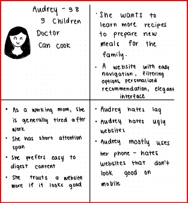
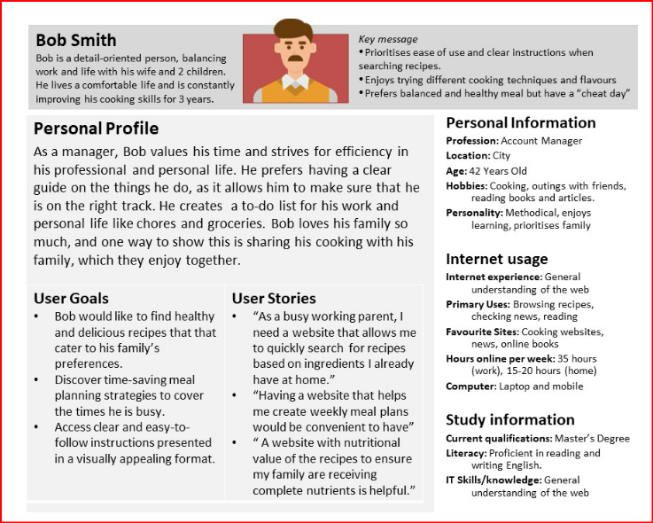

+++    
### Team Members
1. Aayan Rai
2. Benjamin Denison-Love
3. Juan Miguel Badayos
4. Muhammed Abed

### Project Brief
The team is tasked with creating a cooking website designed to boost user engagement and satisfaction. This will be achieved through an intuitive, personalized, and accessible culinary platform. The project aims to tackle the inefficiencies of the current platform which lacks robust filtering options and underutilizes user-generated content. Key focus areas include:

- Personalized recipe recommendations
- Mobile responsiveness
- High-quality multimedia content
- Advanced filtering options (e.g., preparation time, allergens, dietary needs, cooking skills)

### Design Inspirations
Technologies such as HTML, CSS, JavaScript, Python, and API development will be utilized for both front-end and backend development. Tools like Trollo, Jira, and Bitbucket will support the project management and collaboration efforts. The website will feature:

- User-friendly interface
- Multimedia content integration
- User authentication
- Accessibility enhancements

Further, the initiative will emphasize promoting healthy eating habits and continuous optimization based on user feedback.

### Business Assumptions
The website will cater primarily to home cooks, particularly parents, young professionals, and students, offering:

- Recipes tailored to various criteria like available ingredients and dietary restrictions
- Personalized recipe recommendations and community engagement features
- Promotion through social media and SEO to enhance visibility

Success indicators will include metrics like time spent on site, recipe saves, shares, ratings, user retention, and bounce rates.

### User Assumptions
User personas such as "The Busy Professional" and "The Adventurous Foodie" will guide the design and features, aiming to satisfy quick recipe needs and a desire to explore new cuisines respectively.

### Hypothesis Statement
The hypothesis suggests that providing a variety of recipes, detailed instructions, and focusing on healthy and flavorful meals will attract a broader audience and enhance engagement. Success will be evaluated via feedback, website traffic, user engagement, and conversion rates.

### User Stories
User stories focus on enabling quick and healthy recipe discovery for busy professionals and providing adventurous foodies with new cuisines and engaging content.

+++
### Component DEsign
# MVP

+++    
## Proto Personas

Audrey - 38
- Mother of three
- Doctor
- Can cook

**Requirements:**
- Wants to learn more recipes
- Prepares new meals for the family
- Desires a website with easy navigation, filtering options, personalized recommendations, and an elegant interface

**Preferences:**
- Dislikes lag and unattractive websites
- Uses phone frequently; needs mobile-responsive design
- Values aesthetics and trustworthiness in a website's appearance

**Notes:**
- As a working mom, Audrey is usually tired after work and has a short attention span.
- Prefers easy-to-digest content.

## Persona

**Bob Smith:**
- Detail-oriented
- Balances work and life with a wife and two children
- Constantly improves cooking skills, cooking for 3 years.

**Personal Profile:**
- Values time and efficiency
- Enjoys clear guides and to-do lists for organization
- Shares cooking with family

**User Goals:**
- Find healthy and delicious recipes
- Time-saving meal planning strategies
- Access clear and easy-to-follow instructions in a visually appealing format

**User Stories:**
- Needs to quickly find recipes based on ingredients at home
- Wants to create weekly meal plans conveniently
- Seeks nutritional value and complete nutrients for family meals

**Key Message:**
- Seeks ease of use and clear instructions when searching recipes
- Enjoys diverse cooking techniques and flavors
- Prefers balanced meals with occasional "cheat days"

## Information Architecture

The architecture outlines the structure of the website, including sections such as:

- **Menu:** Allergens, Dietary Requirements, Prep Time
- **Home:** Articles, Tips, Interviews, Demonstrations, Tutorials, Recipe Walkthroughs
- **Store:** Merchandise, Books, Kitchen Tools, Cooking Classes
- **Events:** Webinars, Food-related Events
- **Community:** Forum, Comment Section
+++
