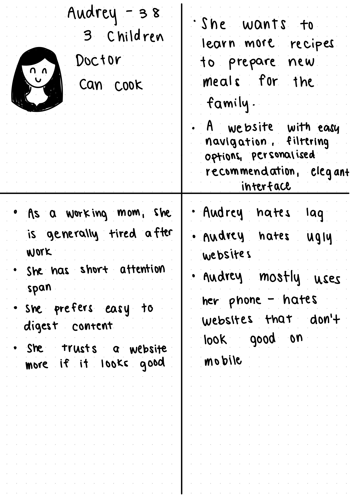
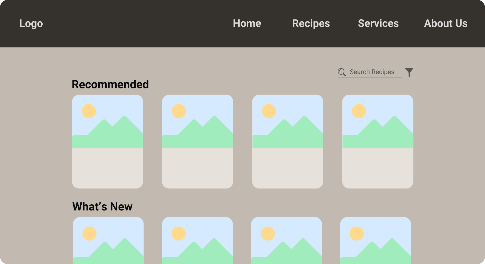
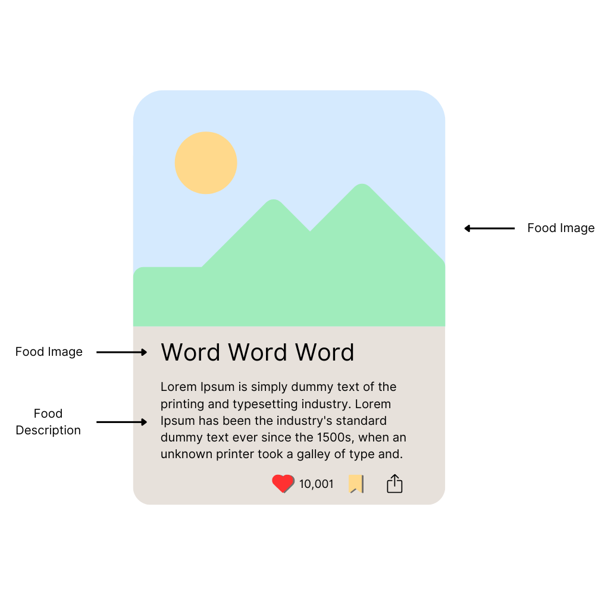
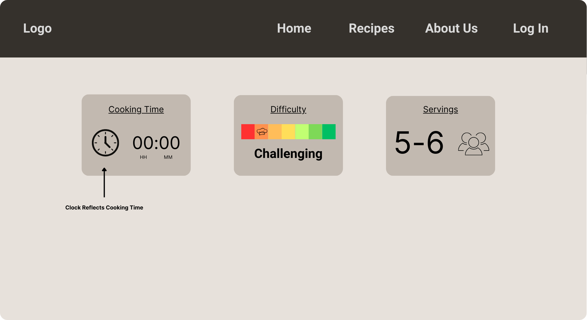

Design  Worksheet
=============

**Team member names:**

 1. Juan Miguel Badayos
 2. Benjamin Denison-Love
 3. Aayan Rai
 4. Muhammed Abed

Project Brief
-------------

Our cooking website aims to provide a platform for users to share, discover, and engage with recipes. However, we have identified a challenge in motivating users to actively participate in recipe exploration and adoption. We have observed that the example product/service website like our goal lack efficient filtering options based on key factors such as preparation time, allergens, dietary requirements, and cooking skill levels. This limitation hampers users' ability to discover relevant recipes tailored to their specific preferences and constraints.
 
Furthermore, there is a perception among users that recipes created or endorsed by professional chefs are of higher quality, more trustworthy, or more appealing compared to recipes shared by non-professionals or amateurs. However, the current lack of user engagement and recipe adoption on our platform poses a risk to its sustainability and growth. Without addressing these issues, we may fail to capitalize on the potential of user-generated content and risk losing users to competitors offering curated content.

The website aims to provide users a platform where users can share their recipe with others and discover new  recipes themselves. The creators of the website would also like to foster engagement and motivation for both beginners and experienced cooks. This can be done by providing users with an intuitive, personalised, and accessible culinary experience by:

1. Easy navigation and search functionality for finding recipes quickly.
2. Personalized recipe recommendations based on user preferences and dietary restrictions.
3. Mobile responsiveness for seamless across devices.
4. High-quality multimedia content, including videos, images and step-by-step instructions.

Design Inspirations
-------------------

The technologies that are being used across the domain in terms of the front-end development are HTML, CSS, and JavaScript. Some of these websites also uses libraries, frameworks, or techniques such as React, Vue, Bootstrap, and Tailwind, Ajax, WordPress, and jQuery for their website. In terms of the back-end development, ASP.NET and WordPress were used in some of the websites.

These technologies used by other cooking websites can be used a guide for building our own website. Generally, HTML, CSS, and JavaScript will be the main building block for our website, ensuring a seamless and user-friendly interface for the users. Some frameworks like Bootstraps can also be used for the interface of the website. Moreover, using JavaScript and Ajax can help users easily filter and find recipes based on their likings and preferences. These technologies also allows user-generated reviews, comments, and ratings, fostering user engagement and constructive criticism. 

Business Assumptions
--------------------

Creators of the website believes that the  users have a need to find recipes that they can cook on their own homes, may it be from the available ingridients they already have at home, for an event, specific dietary needs, and more. These needs can be solved by developing a use-friendly website that provides features that allows easy navigation and filtering of recipes based on the user's needs. Moreover, these needs can also be solved by having personalised recipe recomnmendations based on user preferences and past behaviours.

The initial users of the websites would be members of the family that prepare food for their family, generally mothers and fathers of the family. According from a report by HelloFresh (2017), 97% of Australians cook on weeknights, and 74% of Australians are 'likely to prepare five or more of  their seven weekly dinners at home.' However, the website also considers targetting young professionals or stutends that are interested in easy-to-cook recipes. According to Lindner (2023), in the Us '65% of Gen Z's' showed an interest in cooking as of 2021. A research also stated that 45.7% to  40.3% of college studenets cook (Soldavini & Berner, 2021).

The website is not only limited on users finding for new recipes, but can also create and share their own recipes or versions of the recipe with the community. It can also give users the opportunities to engage with other users with the same passion through comments and ratings. It also allows users to learn new cooking techniques from other cooks.

With the rise of social media platforms, this can be used to promote the website and acquire new users. Creating posts, videos, and other promotions on social media about the website will give potential users what the website is about. Moreover, implementing SEO best practices allows the search engine to better understand the content of the website, helping its visibility to potential users. 

The primary competition in the market are already existing recipe websites such as https://www.recipetiineats.com, https://www.taste.com, and https://www.allrecipes.com. Moreover, cooking apps and YouTube channels or social media accounts that provides cooking content are more competitors of the website. Thus, one way to make our own website standout from the rest is ensuring to provide users a more responsive, easy-to-use, and clean website. The creators of the website also believes that optimising our website to have an advanced filtering options that creates a personalised recipe discovery for users will help gain user numbers. 

Some indicators that will help signify the website's success is when there is an increase in user engagement on the website, such as increase in time spent on the website and increase of number of recipes saved, shared, and rated. Another metrics that can help signify the success of the website is the increase of frequency of returning users and decrease of bounce rate time of users. A feedback form can also be implemented to collect reviews from the users in terms of the overall website.

With these assumptions, the developers are aware that if the assumption with the demographics are incorrect, there will be a huge chance for the project to fail.

User Assumptions
----------------

A potential user of the website could be Audrey, a 38-year-old doctor living at the city with 3 children. She is no stranger to cooking, but recently her children wants something new for dinner. Audrey would use the website to explore new options for dinner and identify the requirements of the recipe. The website addresses Audrey's need to find different recipes depending on her preferences or her childern's wants. Audrey will likely use the website on her phone or laptop, either at home, after work,  or while doing grocery shopping. From this, it is important to have a easy-to-use, responsive, and neat website that allows Audrey to easily find recipes and important information without wasting time.

Hypothesis statement or user stories
------------------------------------

The developers of the website believe that by providing users with advanced filtering options based on preparation time, allergens, dietary requirements, and cooking skill levels, we will increase user engagement and recipe discovery. We will know we are right when we see the following feedback from the users or market:

* **Qualitative Feedback** - Positive user reviews and surveys about how easy for the users to find recipes that are relevant for their needs and preferences.
* **Quantitative Feedback** - Increased user interaction such as time spent on the website and numbers of recipes saved, shared, and rated.
* **Key Performance Indicator Change** - Increase of frequency of returning users and a decrease in bounce rate.

Proto Persona
-------------

Persona
-------

Component design
================

MVP 
---

**MVP Outline for Desktop**

**MVP Outline for Mobile**

Information Architecture
------------------------

#### Card Layout

#### Recipe Title and Description Layout

#### Cooking Time, Difficulty, and Servings Information

#### Quick Link Sample Layout

References:
-----------

HelloFresh. (2017). Australia's Cooking Landscape. https://australianfoodtimeline.com.au/wp-content/uploads/2020/01/HelloFresh_Australia27s-Cooking-Landscape_Report_FINAL_1Feb2017.pdf

Lindner, J. (2023). Cooking Statistics: Market Report & Data. https://gitnux.org/cooking-statistics/

Soldavini, J., Maureen, B. (2021). Characteristics associated with cooking ffreqquency among college students. https://www.sciencedirect.com/science/article/abs/pii/S1878450X21000020

